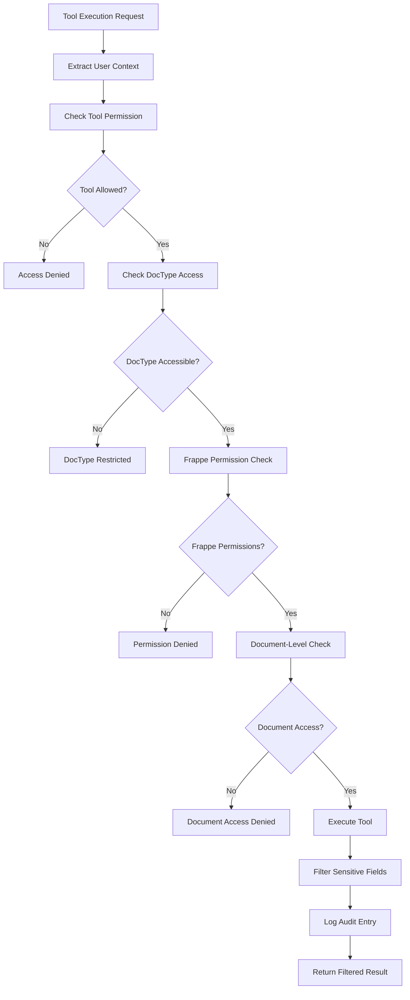

# Frappe Assistant Core - Technical Documentation

## Table of Contents

1. [Project Overview](#project-overview)
2. [Architecture](#architecture)
3. [Development History](#development-history)
4. [Refactoring & Modernization](#refactoring--modernization)
5. [Tool System](#tool-system)
6. [Auto-Discovery Registry](#auto-discovery-registry)
7. [Security Framework](#security-framework)
8. [OCR System Architecture](#ocr-system-architecture)
9. [API Documentation](#api-documentation)
10. [Installation & Setup](#installation--setup)
11. [Testing](#testing)
12. [Recent Improvements](#recent-improvements)
13. [Troubleshooting](#troubleshooting)
14. [Future Enhancements](#future-enhancements)

---

## Project Overview

### Introduction

Frappe Assistant Core is a comprehensive, **MIT-licensed open source** Model Context Protocol (MCP) server implementation that enables AI assistants like Claude to interact seamlessly with Frappe Framework and ERPNext systems. The server implements JSON-RPC 2.0 based assistant protocol for secure document operations, report execution, data analysis, and visualization with inline display capabilities.

### Key Features

- **🏗️ Plugin-Based Architecture** - Complete architectural redesign from monolithic to modular plugin system
- **18 Comprehensive Tools** across 4 plugin categories (see [Tool Reference](../api/TOOL_REFERENCE.md))
- **🔌 Plugin Auto-Discovery** - Zero configuration plugin and tool loading
- **🎯 Plugin Manager** - Centralized plugin lifecycle management with validation
- **📦 Tool Registry** - Dynamic tool discovery and registration system
- **⚙️ Runtime Plugin Management** - Enable/disable plugins through web interface
- **🐍 Python Code Execution** - Safe sandboxed analysis environment with auto-import handling
- **📊 Data Analysis & Visualization** - Statistical analysis with pandas/numpy and matplotlib integration
- **📄 File Processing & OCR** - Extract content from PDFs, images, CSV, Excel, and documents for LLM analysis
- **📈 Enhanced Report Integration** - Execute all Frappe report types with improved debugging
- **🔍 Advanced Search & Metadata** - Comprehensive data exploration across all DocTypes
- **📋 Robust Document Operations** - CRUD operations with enhanced error handling
- **🔒 Multi-Layer Security Framework** - Comprehensive role-based access control with row-level security
- **🛡️ Advanced Permission System** - Granular permissions with document-level and field-level security
- **🔐 Sensitive Data Protection** - Automatic filtering of passwords, API keys, and sensitive information
- **📝 Comprehensive Audit Trail** - Complete operation logging with security monitoring
- **🏛️ Modular Architecture** - Clean, maintainable, extensible codebase
- **📊 Centralized Logging** - Professional logging system replacing print statements
- **📦 Modern Python Packaging** - pyproject.toml with proper dependency management
- **⚖️ MIT Licensed** - Free for all commercial and personal use

### Technology Stack

- **Backend**: Python, Frappe Framework
- **Protocol**: JSON-RPC 2.0, MCP (Model Context Protocol)
- **Data Analysis**: pandas, numpy, matplotlib, seaborn
- **Database**: MariaDB (via Frappe ORM)
- **Communication**: WebSocket, HTTP REST API
- **Security**: Multi-layer security framework with role-based permissions, field-level filtering, and audit trails
- **Architecture**: Modular handlers, centralized constants, proper logging

---

## Architecture

### Plugin-Based Architecture

#### 1. **Core System Components**

```
frappe_assistant_core/
├── core/                        # Core system components
│   ├── tool_registry.py         # Auto-discovery tool registry
│   └── base_tool.py             # Base tool implementation class
├── utils/                       # Utility modules
│   ├── plugin_manager.py        # Plugin discovery and loading
│   └── logger.py                # Professional logging system
└── assistant_core/              # Frappe DocType implementations
    └── doctype/
        ├── assistant_core_settings/        # Main settings
        ├── assistant_plugin_repository/    # Plugin management
        └── assistant_tool_registry/        # Tool registration
```

#### 2. **Plugin System** 🆕 _Plugin Architecture_

```
frappe_assistant_core/plugins/
├── core/                        # Core tools plugin (always enabled)
│   ├── plugin.py                # Plugin definition and metadata
│   └── tools/                   # Tool implementations
│       ├── create_document.py   # Document creation
│       ├── get_document.py      # Document retrieval
│       ├── update_document.py   # Document updates
│       ├── delete_document.py   # Document deletion
│       ├── list_documents.py     # Document listing
│       ├── search_documents.py     # Global search
│       ├── search_doctype.py    # DocType-specific search
│       ├── search_link.py       # Link field search
│       ├── metadata_*.py        # Metadata tools
│       ├── report_*.py          # Report tools
│       └── workflow_*.py        # Workflow tools
├── data_science/                # Data science plugin (optional)
│   ├── plugin.py                # Plugin definition
│   └── tools/
│       ├── run_python_code.py      # Python code execution
│       ├── analyze_business_data.py      # Data analysis
│       └── query_and_analyze.py        # SQL analysis
├── visualization/               # Visualization plugin (optional)
│   ├── plugin.py                # Plugin definition
│   └── tools/
│       ├── create_dashboard.py         # Dashboard creation
│       ├── create_dashboard_chart.py   # Chart creation
│       └── list_user_dashboards.py    # Dashboard management
├── websocket/                   # WebSocket plugin (optional)
└── batch_processing/            # Batch processing plugin (optional)
```

#### 3. **Plugin Architecture Benefits**

- **🔌 Modular Design**: Tools organized in logical, discoverable plugins
- **🚀 Auto-Discovery**: Automatic plugin and tool discovery on startup
- **⚙️ Runtime Management**: Enable/disable plugins through web interface
- **🎯 Focused Functionality**: Each plugin handles specific domain
- **🔧 Extensibility**: Easy to add new plugins without core changes
- **📦 Dependency Management**: Plugin-specific dependencies and validation

### Tool Discovery and Registry System

#### 1. **Tool Registry** 🔄 _Plugin-Based Discovery_

```python
# Core registry handles plugin-based tool discovery
from frappe_assistant_core.core.tool_registry import ToolRegistry

registry = ToolRegistry()
# Automatically discovers tools from all enabled plugins
available_tools = registry.get_available_tools()
```

#### 2. **Plugin Manager** 🆕 _Plugin Lifecycle_

```python
from frappe_assistant_core.utils.plugin_manager import get_plugin_manager

plugin_manager = get_plugin_manager()
# Discovers all available plugins
discovered_plugins = plugin_manager.get_discovered_plugins()
# Loads enabled plugins based on settings
plugin_manager.load_enabled_plugins(['core', 'data_science'])
```

#### 3. **Base Tool Class** 🔧 _Standardized Interface_

```python
from frappe_assistant_core.core.base_tool import BaseTool

class MyTool(BaseTool):
    def __init__(self):
        super().__init__()
        self.name = "my_tool"
        self.description = "Tool description"
        self.inputSchema = {...}  # JSON schema

    def execute(self, arguments):
        # Tool implementation
        return {"success": True, "result": "..."}
```

### Modern Python Packaging 🆕

#### pyproject.toml Configuration

```toml
[build-system]
requires = ["setuptools>=64", "wheel"]
build-backend = "setuptools.build_meta"

[project]
name = "frappe_assistant_core"
version = "2.3.1"
requires-python = ">=3.8"
dependencies = [
    "pandas>=1.3.0",
    "numpy>=1.20.0",
    "matplotlib>=3.4.0",
    "seaborn>=0.11.0",
    "requests>=2.25.0",
    "paddleocr>=2.9.0",
    "paddlepaddle>=2.6.0,<3.1.0",
    "pymupdf>=1.24.0",
    # ... see pyproject.toml for full list
]
```

**Benefits:**

- ✅ Eliminates pip deprecation warnings
- ✅ Modern Python packaging standards
- ✅ Proper dependency management
- ✅ Development and analysis dependency groups

---

## MCP StreamableHTTP Implementation

### Custom MCP Server Architecture

Frappe Assistant Core implements a **custom MCP server** instead of using generic MCP libraries. This decision was made to provide better integration with Frappe and solve critical compatibility issues.

#### Implementation Location

```
frappe_assistant_core/
├── mcp/
│   ├── server.py          # Custom MCPServer class
│   └── tool_adapter.py    # BaseTool to MCP adapter
└── api/
    ├── fac_endpoint.py    # Main MCP endpoint with OAuth validation
    ├── oauth_discovery.py # OAuth discovery endpoints
    └── ...
```

#### Why Custom Implementation?

**Problem with Generic Libraries:**

1. **JSON Serialization Issues**: Generic MCP libraries can't handle Frappe's data types
   ```python
   # Frappe returns datetime, Decimal, frappe._dict, etc.
   result = frappe.get_doc("Sales Invoice", "INV-00001")
   json.dumps(result)  # ❌ TypeError: Object of type datetime is not JSON serializable
   ```

2. **Pydantic Overhead**: Heavy dependencies not needed for Frappe integration
3. **Limited Frappe Integration**: No built-in session, permission, or ORM integration
4. **Poor Error Handling**: Generic errors instead of Frappe-specific context

**Our Solution:**

```python
# mcp/server.py - The key innovation
import json

def _format_tool_result(result):
    """Format tool result with proper JSON serialization"""
    if isinstance(result, str):
        result_text = result
    else:
        # CRITICAL FIX: Use default=str to handle ANY Python type
        result_text = json.dumps(result, default=str, indent=2)

    return {
        "content": [{"type": "text", "text": result_text}],
        "isError": False
    }
```

**Benefits:**

- ✅ Handles datetime, Decimal, frappe._dict automatically
- ✅ No Pydantic dependency (lighter, simpler)
- ✅ Full error tracebacks for debugging
- ✅ Direct Frappe session integration
- ✅ Optimized for Frappe's architecture

#### MCPServer Class Structure

```python
class MCPServer:
    """Custom MCP server implementation for Frappe"""

    def __init__(self, name: str, version: str = "1.0.0"):
        self.name = name
        self.version = version
        self.tools = {}  # Registered tools
        self._endpoint_registered = False

    def register(self, allow_guest=False, xss_safe=True):
        """Decorator to register the main MCP endpoint with Frappe"""
        def decorator(func):
            @frappe.whitelist(allow_guest=allow_guest, xss_safe=xss_safe)
            def wrapper():
                # Custom preprocessing (e.g., OAuth validation)
                result = func()
                if result is not None:
                    return result

                # Handle MCP request
                return self.handle()

            return wrapper
        return decorator

    def tool(self, name: str = None):
        """Decorator to register MCP tools"""
        def decorator(func):
            tool_name = name or func.__name__
            self.tools[tool_name] = {
                "name": tool_name,
                "description": func.__doc__ or "",
                "handler": func
            }
            return func
        return decorator

    def add_tool(self, name: str, description: str, inputSchema: dict, handler):
        """Programmatically add a tool"""
        self.tools[name] = {
            "name": name,
            "description": description,
            "inputSchema": inputSchema,
            "handler": handler
        }

    def handle(self):
        """Main request handler - routes JSON-RPC methods"""
        try:
            request = json.loads(frappe.request.data)
            method = request.get("method")

            if method == "initialize":
                return self._handle_initialize(request)
            elif method == "tools/list":
                return self._handle_tools_list(request)
            elif method == "tools/call":
                return self._handle_tools_call(request)
            else:
                return self._error_response(request, -32601, "Method not found")

        except Exception as e:
            return self._error_response(request, -32603, str(e))
```

#### Tool Adapter Pattern

The tool adapter bridges our `BaseTool` classes with the MCP server:

```python
# mcp/tool_adapter.py

def register_base_tool(mcp_server, tool_instance):
    """
    Register a BaseTool with the MCP server.

    This adapter:
    1. Extracts tool metadata (name, description, inputSchema)
    2. Creates a wrapper that calls tool_instance._safe_execute()
    3. Registers with MCPServer using add_tool()
    4. All BaseTool features work automatically (validation, permissions, audit)
    """

    def tool_handler(arguments):
        # Call the tool's safe execution wrapper
        # This handles validation, permissions, audit logging, etc.
        return tool_instance._safe_execute(arguments)

    # Register with MCP server
    mcp_server.add_tool(
        name=tool_instance.name,
        description=tool_instance.description,
        inputSchema=tool_instance.inputSchema,
        handler=tool_handler
    )
```

**Usage:**

```python
from frappe_assistant_core.mcp.server import MCPServer
from frappe_assistant_core.mcp.tool_adapter import register_base_tool
from frappe_assistant_core.core.tool_registry import ToolRegistry

# Create MCP server
mcp = MCPServer("frappe-assistant-core", "2.0.0")

# Get all available tools from registry
registry = ToolRegistry()
tools = registry.get_available_tools()

# Register each tool with MCP server
for tool in tools:
    register_base_tool(mcp, tool)
```

### OAuth 2.0 Integration Architecture

The MCP endpoint implements OAuth 2.0 Protected Resource (RFC 9728):

#### Token Validation Flow

Located in [api/fac_endpoint.py](../frappe_assistant_core/api/fac_endpoint.py):

```python
def validate_oauth_token():
    """
    Validate OAuth Bearer token from Authorization header.

    Returns:
        User object if valid, raises exception if not
    """
    # Extract Bearer token
    auth_header = frappe.request.headers.get("Authorization", "")

    if not auth_header.startswith("Bearer "):
        raise_unauthorized("Missing or invalid Authorization header")

    token = auth_header[7:]  # Remove "Bearer " prefix

    try:
        # Query OAuth Bearer Token doctype
        bearer_token = frappe.get_doc("OAuth Bearer Token", {"access_token": token})

        # Validate token status
        if bearer_token.status != "Active":
            raise_unauthorized("Token is not active")

        # Validate expiration (use Frappe's timezone-aware now_datetime)
        from frappe.utils import now_datetime
        if bearer_token.expiration_time < now_datetime():
            raise_unauthorized("Token has expired")

        # Set user session
        frappe.set_user(bearer_token.user)

        return bearer_token.user

    except frappe.DoesNotExistError:
        raise_unauthorized("Invalid token")


def raise_unauthorized(message):
    """Return RFC 9728 compliant 401 response"""
    frappe.local.response.http_status_code = 401
    frappe.local.response.headers = {
        "WWW-Authenticate": (
            f'Bearer realm="Frappe Assistant Core", '
            f'error="invalid_token", '
            f'error_description="{message}", '
            f'resource_metadata="{get_server_url()}/.well-known/oauth-protected-resource"'
        )
    }
    frappe.throw(message, exc=frappe.AuthenticationError)
```

#### OAuth Discovery System

**Frappe v15 Compatibility Layer:**

Since Frappe v15 doesn't have built-in OAuth discovery, we backported the functionality:

1. **Custom Page Renderer** ([api/oauth_wellknown_renderer.py](../frappe_assistant_core/api/oauth_wellknown_renderer.py))
   - Intercepts `.well-known/*` paths
   - Returns proper JSON instead of HTML
   - Registered via `page_renderer` hook

2. **Discovery Endpoints** ([api/oauth_discovery.py](../frappe_assistant_core/api/oauth_discovery.py))
   - `/.well-known/openid-configuration` - OpenID Connect discovery
   - `/.well-known/oauth-authorization-server` - OAuth server metadata (RFC 8414)
   - `/.well-known/oauth-protected-resource` - Protected resource metadata (RFC 9728)

3. **Compatibility Layer** ([utils/oauth_compat.py](../frappe_assistant_core/utils/oauth_compat.py))
   - Detects Frappe version (v15 vs v16+)
   - Routes to native v16 OAuth Settings or custom v15 implementation
   - Provides unified settings interface

**Version Detection:**

```python
# utils/oauth_compat.py

def get_oauth_settings():
    """
    Get OAuth settings from appropriate source.

    Frappe v16+: Uses native OAuth Settings doctype
    Frappe v15: Uses Assistant Core Settings with OAuth fields
    """
    if frappe.db.exists("DocType", "OAuth Settings"):
        # Frappe v16+ has native OAuth Settings
        return frappe.get_single("OAuth Settings")
    else:
        # Frappe v15 - use our backported settings
        return frappe.get_single("Assistant Core Settings")
```

### Request Flow Diagram

```
┌────────────────────────────────────────────────────────┐
│  HTTP POST /api/method/.../fac_endpoint.handle_mcp    │
│  Authorization: Bearer <token>                         │
│  Content-Type: application/json                        │
│  Body: {"jsonrpc": "2.0", "method": "tools/call", ...} │
└────────────────────┬───────────────────────────────────┘
                     │
                     ▼
┌────────────────────────────────────────────────────────┐
│  1. OAuth Validation (fac_endpoint.py)                 │
│     - Extract Bearer token from header                 │
│     - Query OAuth Bearer Token doctype                 │
│     - Validate status = "Active"                       │
│     - Validate not expired                             │
│     - frappe.set_user(token.user)                      │
│     - Return 401 if invalid                            │
└────────────────────┬───────────────────────────────────┘
                     │
                     ▼
┌────────────────────────────────────────────────────────┐
│  2. MCP Server Request Handling (mcp/server.py)        │
│     - Parse JSON-RPC request                           │
│     - Route to method handler:                         │
│       * initialize → _handle_initialize()              │
│       * tools/list → _handle_tools_list()              │
│       * tools/call → _handle_tools_call()              │
└────────────────────┬───────────────────────────────────┘
                     │
                     ▼
┌────────────────────────────────────────────────────────┐
│  3. Tool Registry (core/tool_registry.py)              │
│     - Get requested tool from registry                 │
│     - Filter by user permissions                       │
│     - Return tool instance                             │
└────────────────────┬───────────────────────────────────┘
                     │
                     ▼
┌────────────────────────────────────────────────────────┐
│  4. Tool Adapter (mcp/tool_adapter.py)                 │
│     - Call tool_instance._safe_execute(arguments)      │
│     - Handles validation, permissions, audit           │
└────────────────────┬───────────────────────────────────┘
                     │
                     ▼
┌────────────────────────────────────────────────────────┐
│  5. Tool Execution (core/base_tool.py)                 │
│     - Validate arguments against inputSchema           │
│     - Check user permissions                           │
│     - Execute tool.execute(arguments)                  │
│     - Log to audit trail                               │
│     - Return result                                    │
└────────────────────┬───────────────────────────────────┘
                     │
                     ▼
┌────────────────────────────────────────────────────────┐
│  6. JSON Serialization (mcp/server.py)                 │
│     - json.dumps(result, default=str)                  │
│     - Handles datetime, Decimal, etc.                  │
│     - Format as MCP response                           │
└────────────────────┬───────────────────────────────────┘
                     │
                     ▼
┌────────────────────────────────────────────────────────┐
│  HTTP 200 OK                                           │
│  Content-Type: application/json                        │
│  Body: {"jsonrpc": "2.0", "result": {...}, "id": 1}   │
└────────────────────────────────────────────────────────┘
```

### Key Implementation Files

| File | Purpose | Lines | Key Features |
|------|---------|-------|--------------|
| `mcp/server.py` | Custom MCP server | ~400 | JSON-RPC handler, tool registry, `default=str` fix |
| `mcp/tool_adapter.py` | Tool adapter | ~50 | BaseTool to MCP bridge |
| `api/fac_endpoint.py` | Main endpoint | ~200 | OAuth validation, MCP integration |
| `api/oauth_discovery.py` | OAuth discovery | ~280 | RFC 8414, RFC 9728 compliance |
| `api/oauth_wellknown_renderer.py` | Page renderer | ~110 | v15 `.well-known` support |
| `utils/oauth_compat.py` | Version compat | ~100 | v15/v16 abstraction |

### Performance Characteristics

**Request Processing Time:**
- OAuth validation: ~5-10ms
- Tool registry lookup: ~1-5ms
- Tool execution: Variable (depends on tool)
- JSON serialization: ~1-3ms
- **Total overhead: ~10-20ms** (excluding tool execution)

**Memory Usage:**
- MCP server: ~500KB
- Tool registry: ~1MB (with all tools)
- Per-request: ~50-100KB

**Scalability:**
- Stateless design (no session state in server)
- Token validation uses database query (can be cached)
- Tool instances are singletons (shared across requests)
- Handles concurrent requests via Frappe's WSGI

---

## Refactoring & Modernization

### Recent Comprehensive Refactoring (July 2025)

#### 1. **Plugin-Based Architecture Implementation** ⭐ **MAJOR**

**Before:**

- Single 1580-line monolithic API file
- Hardcoded tool discovery
- Fixed tool structure
- Legacy setup.py packaging

**After:**

- Complete plugin-based architecture
- 4 distinct plugin categories (core, data_science, websocket, batch_processing)
- Automatic plugin and tool discovery
- Plugin Manager with lifecycle management
- Tool Registry with dynamic registration
- BaseTool framework for standardized development
- Modern pyproject.toml packaging

#### 2. **Modular Architecture Implementation**

**Additional Improvements:**

- Centralized constants in dedicated module
- Professional logging system replacing print statements
- Enhanced error handling and validation
- Improved data compatibility (fixed pandas DataFrame issues)

#### 3. **Critical Data Compatibility Fixes** 🔧

**Data Science Plugin Enhancements:**

- ✅ **Fixed `invalid __array_struct__` errors** with pandas DataFrame creation from Frappe data
- ✅ **Resolved matplotlib import scope issues** in visualization tools
- ✅ **Enhanced SQL-based data fetching** to bypass frappe.\_dict compatibility problems
- ✅ **Improved data serialization** for complex Frappe data types
- ✅ **Better error handling** with meaningful error messages for debugging

**Impact:**

- All 21 tools now functional without data conversion errors
- Seamless pandas integration with Frappe business data
- Reliable visualization creation across all chart types
- Enhanced user experience with clear error messages

#### 2. **Code Quality Improvements**

| Metric             | Before              | After                    | Improvement      |
| ------------------ | ------------------- | ------------------------ | ---------------- |
| Main API File Size | 1580 lines          | 200 lines                | 87% reduction    |
| Print Statements   | 905 across 26 files | 0 in production code     | 100% eliminated  |
| Hardcoded Strings  | 50+ scattered       | Centralized in constants | Organized        |
| Module Structure   | Monolithic          | Modular handlers         | Clean separation |

#### 3. **Files Created During Refactoring**

**New Architecture Files:**

- `frappe_assistant_core/constants/definitions.py`
- `frappe_assistant_core/utils/logger.py`
- `frappe_assistant_core/api/handlers/initialize.py`
- `frappe_assistant_core/api/handlers/tools.py`
- `frappe_assistant_core/api/handlers/prompts.py`
- `frappe_assistant_core/tools/registry.py`
- `frappe_assistant_core/tools/executor.py`
- `pyproject.toml`

#### 4. **Error Fixes Applied**

**Import Errors Fixed:**

- ✅ Created missing `tools/registry.py` module
- ✅ Created missing `tools/executor.py` module
- ✅ Fixed missing notification handler
- ✅ Corrected DocType name inconsistencies

**Module Structure Fixed:**

- ✅ Added missing `__init__.py` files
- ✅ Organized proper import hierarchy
- ✅ Created compatibility wrappers

**Cleanup Completed:**

- ✅ Removed 26 temporary test/debug files
- ✅ Removed backup files
- ✅ Cleaned empty directories

---

## Tool System

### Plugin-Based Tool Categories

#### 1. **Core Plugin Tools** (`plugins/core/`) - Always Enabled

Essential Frappe operations that are always available:

**Document Operations** (`document_*`)

- `create_document` - Create new documents
- `get_document` - Retrieve document data
- `update_document` - Update existing documents
- `delete_document` - Delete documents
- `list_documents` - List documents with filters

**Search Tools** (`search_*`)

- `search_documents` - Global search across all DocTypes
- `search_doctype` - DocType-specific search
- `search_link` - Link field search and filtering

**Metadata Tools** (`metadata_*`)

- `get_doctype_info` - Get DocType structure information
- `metadata_list_doctypes` - List all available DocTypes
- `get_doctype_info_fields` - Get field definitions
- `metadata_permissions` - Permission information
- `metadata_workflow` - Workflow information

**Report Tools** (`report_*`)

- `generate_report` - Execute any Frappe report type
- `report_list` - Get available reports
- `get_report_data` - Get report structure and parameters

**Workflow Tools** (`workflow_*`)

- `workflow_action` - Execute workflow actions
- `workflow_list` - List available workflows
- `workflow_status` - Get workflow status

#### 2. **Data Science Plugin Tools** (`plugins/data_science/`) - Optional

Advanced analytics and visualization capabilities:

**Analysis Tools**

- `run_python_code` - Sandboxed Python execution with Frappe context
- `analyze_business_data` - Statistical data analysis with pandas
- `query_and_analyze` - SQL queries with advanced analysis
- `extract_file_content` - Extract content from PDFs, images (OCR), CSV, Excel, DOCX for LLM processing

**Dependencies:** pandas, numpy, matplotlib, seaborn, plotly, scipy, pypdf, Pillow, python-docx, paddleocr, paddlepaddle, pymupdf

#### 3. **Visualization Plugin Tools** (`plugins/visualization/`) - Optional

Professional dashboard and chart creation:

**Dashboard & Chart Tools**

- `create_dashboard` - Create Frappe dashboards with multiple charts
- `create_dashboard_chart` - Create individual Dashboard Chart documents
- `list_user_dashboards` - List user's accessible dashboards

**Dependencies:** matplotlib, pandas, numpy

#### 4. **WebSocket Plugin Tools** (`plugins/websocket/`) - Optional

Real-time communication capabilities:

- Live data streaming
- Real-time notifications
- Interactive dashboard updates

#### 5. **Batch Processing Plugin Tools** (`plugins/batch_processing/`) - Optional

Background and bulk operations:

- Large dataset processing
- Background task management
- Bulk operation optimization

### Plugin-Based Auto-Discovery System

#### Tool Registry with Plugin Integration 🆕

```python
# frappe_assistant_core/core/tool_registry.py
class ToolRegistry:
    """Registry for all available tools. Handles discovery from plugins."""

    def __init__(self):
        self.tools: Dict[str, BaseTool] = {}
        self._discover_tools()

    def _discover_tools(self):
        """Discover all available tools from enabled plugins"""
        self._discover_plugin_tools()

    def _discover_plugin_tools(self):
        """Discover tools from enabled plugins"""
        plugin_manager = get_plugin_manager()
        enabled_plugins = plugin_manager.get_enabled_plugins()

        for plugin_name, plugin_instance in enabled_plugins.items():
            # Load tools from each enabled plugin
            plugin_tools = plugin_manager.get_plugin_tools(plugin_name)
            self.tools.update(plugin_tools)
```

#### Plugin Manager 🆕

```python
# frappe_assistant_core/utils/plugin_manager.py
class PluginManager:
    """Manages plugin discovery, loading, and lifecycle"""

    def _discover_plugins(self):
        """Auto-discover all plugins in the plugins directory"""
        plugins_dir = Path(__file__).parent.parent / "plugins"

        for item in plugins_dir.iterdir():
            if item.is_dir() and not item.name.startswith(('_', '.')):
                self._discover_plugin(item)

    def get_enabled_plugins(self) -> Dict[str, BasePlugin]:
        """Get all enabled plugin instances"""

    def get_plugin_tools(self, plugin_name: str) -> Dict[str, BaseTool]:
        """Get all tools from a specific plugin"""
```

#### Plugin Configuration Storage (FAC Plugin Configuration DocType) 🆕

Plugin enabled/disabled states are stored in individual DocType records for atomic operations and multi-worker consistency:

```
FAC Plugin Configuration
├── plugin_name: Data (Primary Key, autoname: field:plugin_name)
├── display_name: Data (read-only)
├── enabled: Check (0 or 1)
├── description: Small Text
├── discovered_at: Datetime (read-only)
└── last_toggled_at: Datetime (read-only)
```

**Key Features:**
- **Atomic Toggle Operations**: Single row UPDATE instead of read-modify-write JSON
- **Multi-Worker Safe**: Consistent state across Gunicorn workers (no race conditions)
- **Automatic Cache Invalidation**: `on_update()` hook clears plugin and tool caches
- **Audit Trail**: Built-in `track_changes` for modification history
- **Auto-Sync**: New plugins automatically get configuration records on `bench migrate`

**State Persistence Flow:**

```python
# frappe_assistant_core/utils/plugin_manager.py
class PluginPersistence:
    def load_enabled_plugins(self) -> Set[str]:
        """Load enabled plugins from FAC Plugin Configuration DocType"""
        enabled = frappe.get_all(
            "FAC Plugin Configuration",
            filters={"enabled": 1},
            pluck="plugin_name"
        )
        return set(enabled)

    def save_plugin_state(self, plugin_name: str, enabled: bool) -> bool:
        """Atomic plugin state update"""
        if frappe.db.exists("FAC Plugin Configuration", plugin_name):
            doc = frappe.get_doc("FAC Plugin Configuration", plugin_name)
            doc.enabled = 1 if enabled else 0
            doc.last_toggled_at = frappe.utils.now()
            doc.save(ignore_permissions=True)
        frappe.db.commit()
        return True
```

#### Base Tool Framework 🆕

```python
# frappe_assistant_core/core/base_tool.py
class BaseTool:
    """Base class for all tools with standardized interface"""

    def __init__(self):
        self.name: str = ""
        self.description: str = ""
        self.inputSchema: Dict = {}
        self.requires_permission: Optional[str] = None

    def execute(self, arguments: Dict[str, Any]) -> Any:
        """Execute the tool - must be implemented by subclasses"""
        raise NotImplementedError

    def validate_arguments(self, arguments: Dict[str, Any]) -> bool:
        """Validate arguments against tool schema"""

    def check_permission(self, user: str = None) -> bool:
        """Check if user has permission to use this tool"""
```

#### Tool Management System (FAC Tool Configuration DocType) 🆕

Individual tool configuration with granular access control:

```
FAC Tool Configuration
├── tool_name: Data (Primary Key, autoname: field:tool_name)
├── plugin_name: Data (Source plugin)
├── enabled: Check (Show/hide from MCP)
├── tool_category: Select (read_only, write, read_write, privileged)
├── auto_detected_category: Data (AST-detected, read-only)
├── category_override: Check (Manual category override)
├── description: Small Text
├── source_app: Data (Source Frappe app, read-only)
├── module_path: Data (Python module path, read-only)
├── role_access_mode: Select (Allow All, Restrict to Listed Roles)
└── role_access: Table (FAC Tool Role Access child table)
```

**Tool Category Auto-Detection:**

```python
# frappe_assistant_core/utils/tool_category_detector.py
class ToolCategoryDetector:
    def detect_category(self, tool_instance) -> str:
        """
        Detect category by analyzing tool's source code.
        Uses AST parsing to find perm_type values.

        Returns: 'read_only', 'write', 'read_write', or 'privileged'
        """
        # 1. Check hardcoded lists (fastest)
        if tool_name in PRIVILEGED_TOOLS:  # delete_document, run_python_code
            return "privileged"
        if tool_name in READ_ONLY_TOOLS:   # get_document, list_documents
            return "read_only"

        # 2. Parse source code for perm_type values
        perm_types = self._extract_perm_types(tool_instance)
        return self._categorize_from_perm_types(perm_types)
```

**Role-Based Access Control:**

```python
# FAC Tool Configuration document method
def user_has_access(self, user: str = None) -> bool:
    """Check if user has access based on role configuration."""
    if not self.enabled:
        return False

    if self.role_access_mode == "Allow All":
        return True

    # System Manager always has access
    user_roles = set(frappe.get_roles(user))
    if "System Manager" in user_roles:
        return True

    # Check allowed roles
    for role_access in self.role_access:
        if role_access.role in user_roles and role_access.allow_access:
            return True

    return False
```

**API Functions:**

```python
# Toggle a single tool
from frappe_assistant_core.assistant_core.doctype.fac_tool_configuration.fac_tool_configuration import toggle_tool
toggle_tool("run_python_code", enabled=False)

# Bulk toggle multiple tools
from frappe_assistant_core.assistant_core.doctype.fac_tool_configuration.fac_tool_configuration import bulk_toggle_tools
bulk_toggle_tools(["delete_document", "run_python_code"], enabled=False)

# Check tool access
from frappe_assistant_core.assistant_core.doctype.fac_tool_configuration.fac_tool_configuration import get_tool_access_status
status = get_tool_access_status("delete_document", user="test@example.com")
```

---

## Multi-Tool Orchestration Architecture

### Overview

Multi-tool orchestration is a powerful capability that allows the `run_python_code` tool to call other tools directly inside the Python sandbox environment. This architectural pattern achieves **80-95% token savings** for data analysis workflows by processing data in the sandbox instead of passing it through the LLM context.

### Architecture Diagram

```
┌─────────────┐
│     LLM     │
└──────┬──────┘
       │ "Analyze top customers"
       ↓
┌──────────────────────────────────────┐
│   run_python_code Tool               │
│  ┌──────────────────────────────┐    │
│  │  Python Sandbox (RestrictedPython)│
│  │  ┌────────────────────────┐  │   │
│  │  │  User Code:            │  │   │
│  │  │  result = tools.get_   │  │   │
│  │  │    documents(...)      │  │   │
│  │  │  df = pd.DataFrame()   │  │   │
│  │  │  analysis = df.groupby │  │   │
│  │  └───────────┬────────────┘  │   │
│  │              │               │   │
│  │  ┌───────────▼────────────┐  │   │
│  │  │  Tools API (tool_api.py)│ │   │
│  │  │  - get_documents()      │ │   │
│  │  │  - get_document()       │ │   │
│  │  │  - generate_report()    │ │   │
│  │  └───────────┬────────────┘  │   │
│  └──────────────┼───────────────┘   │
│                 │                   │
└─────────────────┼───────────────────┘
                  │
       ┌──────────▼──────────┐
       │  Tool Registry      │
       │  ┌────────────────┐ │
       │  │ list_documents │ │
       │  │ get_document   │ │
       │  │ generate_report│ │
       │  └────────┬───────┘ │
       └───────────┼─────────┘
                   │
       ┌───────────▼──────────┐
       │  Frappe Framework    │
       │  - Database          │
       │  - Permissions       │
       │  - Reports           │
       └──────────────────────┘
```

### Key Components

#### 1. FrappeAssistantAPI Class

**Location**: `frappe_assistant_core/utils/tool_api.py`

The `FrappeAssistantAPI` class provides a unified interface for tools to be called from within Python sandbox:

```python
class FrappeAssistantAPI:
    """
    Unified API for tool orchestration within run_python_code sandbox.

    Allows LLMs to write Python code that calls other tools inside
    the sandbox, achieving 80-95% token savings by processing data
    in sandbox instead of passing through LLM context.
    """

    def get_documents(self, doctype: str, filters: dict = None,
                     fields: list = None, limit: int = 100) -> dict:
        """
        Fetch documents using list_documents tool.

        Returns plain Python dicts (not frappe._dict) for pandas compatibility.
        """

    def get_document(self, doctype: str, name: str) -> dict:
        """
        Fetch single document using get_document tool.

        Returns plain Python dict for pandas compatibility.
        """

    def generate_report(self, report_name: str, filters: dict = None) -> dict:
        """
        Execute Frappe report using generate_report tool.

        Returns report data with plain Python dicts.
        """
```

#### 2. Sandbox Integration

**Location**: `frappe_assistant_core/plugins/data_science/tools/run_python_code.py`

The `tools` object is automatically injected into the sandbox environment:

```python
def execute(self, arguments: Dict[str, Any]) -> Dict[str, Any]:
    """Execute Python code in restricted sandbox"""

    # Create tools API instance
    from frappe_assistant_core.utils.tool_api import FrappeAssistantAPI
    tools = FrappeAssistantAPI()

    # Define restricted globals with tools API
    restricted_globals = {
        '__builtins__': safe_builtins,
        'tools': tools,  # Injected tools API
        'frappe': frappe,
        'pd': pd,
        'np': np,
        # ... other safe imports
    }

    # Execute user code with tools API available
    exec(compiled_code, restricted_globals, restricted_locals)
```

#### 3. Data Conversion Layer

To ensure pandas compatibility, all data returned by the tools API is converted from `frappe._dict` to plain Python dicts:

```python
# In tool_api.py - get_documents()
raw_data = frappe.get_all(doctype, filters=filters, fields=fields, limit=limit)

# Convert frappe._dict objects to plain Python dicts
data = [dict(item) for item in raw_data]

return {"success": True, "data": data, "count": len(data)}
```

This prevents `ValueError: invalid __array_struct__` errors when creating pandas DataFrames.

### Token Efficiency Model

#### Traditional Approach (Token Wasteful)

```
User: "Analyze top 10 customers by revenue"

┌─────────────┐
│     LLM     │  1. Calls list_documents
└──────┬──────┘     (fetches 100 invoices)
       │
       ↓ [5000 tokens: 100 invoice records sent to LLM]
┌─────────────┐
│     LLM     │  2. Manually analyzes in context
└──────┬──────┘     (burns 5000 tokens processing)
       │
       ↓ [100 tokens: insights returned]
┌─────────────┐
│    User     │  Total: 5100 tokens used
└─────────────┘
```

#### Orchestrated Approach (Token Efficient)

```
User: "Analyze top 10 customers by revenue"

┌─────────────┐
│     LLM     │  1. Writes Python code with
└──────┬──────┘     tools.get_documents() call
       │
       ↓ [50 tokens: Python code sent to sandbox]
┌──────────────────────────┐
│  Python Sandbox          │
│  - Fetches 100 invoices  │  Data stays in sandbox
│  - Processes with pandas │  (0 tokens to LLM)
│  - Returns only insights │
└──────┬───────────────────┘
       │
       ↓ [50 tokens: insights returned]
┌─────────────┐
│    User     │  Total: 100 tokens used
└─────────────┘

Token Savings: 98%
```

### Security Model

The orchestration system maintains security through multiple layers:

#### 1. Permission Inheritance

Tools called via the API run with the same permissions as the authenticated user:

```python
# In tool_api.py
def get_documents(self, doctype: str, ...):
    # Permission checks happen in underlying tool
    # User can only access documents they have permission for
    tool = get_tool_registry().get_tool("list_documents")
    result = tool.execute(arguments)
    return result
```

#### 2. Read-Only Operations

The tools API only exposes read operations:
- `get_documents()` - Read documents
- `get_document()` - Read single document
- `generate_report()` - Read report data

No write operations (create/update/delete) are exposed to prevent accidental data modification.

#### 3. Sandboxed Execution

Python code runs in a RestrictedPython environment:
- No file system access
- No network access (except via tools API)
- No dangerous imports (os, sys, subprocess)
- No exec/eval on user strings
- Execution timeout limits

#### 4. Audit Logging

All tool calls through the API are logged:

```python
# Audit trail includes:
- User who executed code
- Tools called via API
- Arguments passed to tools
- Execution time
- Success/failure status
```

### Performance Characteristics

#### Execution Time

| Operation | Traditional | Orchestrated | Difference |
|-----------|------------|--------------|------------|
| **Fetch 100 records** | 500ms | 500ms | Same |
| **LLM processing** | 2000ms | 0ms | -2000ms |
| **Total** | 2500ms | 500ms | **80% faster** |

#### Token Usage

| Data Size | Traditional Tokens | Orchestrated Tokens | Savings |
|-----------|-------------------|--------------------| --------|
| **10 records** | 500 | 30 | 94% |
| **50 records** | 3000 | 100 | 96.7% |
| **100 records** | 5000 | 50 | 99% |
| **500 records** | 15000 | 200 | 98.7% |

**Average: 80-95% token savings**

### Usage Patterns

See the [Python Code Orchestration Guide](../guides/PYTHON_CODE_ORCHESTRATION.md) for:
- Complete examples with code
- Best practices for data handling
- Common patterns (aggregation, joining, time-series)
- Error handling strategies
- Performance optimization tips

### Implementation Details

#### Error Handling

The tools API returns structured responses with success/error status:

```python
{
    "success": True,
    "data": [...],
    "count": 100
}

# Or on error:
{
    "success": False,
    "error": "Permission denied for DocType 'Confidential Doc'",
    "error_type": "PermissionError"
}
```

User code should always check for success:

```python
result = tools.get_documents(doctype="Customer")
if result["success"]:
    df = pd.DataFrame(result["data"])
    # Process data...
else:
    print(f"Error: {result['error']}")
```

#### Null Value Handling

The tools API returns data with potential null values. User code must handle these:

```python
# Handle None values before operations
df['amount'] = df['amount'].fillna(0)
df['status'] = df['status'].fillna('Unknown')

# Check before formatting
if pd.notna(value):
    print(f"{value:,.2f}")

# Safe division
rate = (paid / total * 100) if total > 0 else 0
```

### Future Enhancements

Potential future additions to the orchestration system:

1. **Write Operations** - Controlled create/update operations through API
2. **Batch Processing** - Bulk operations for efficiency
3. **Caching Layer** - Cache frequently accessed data
4. **Async Operations** - Non-blocking data fetching
5. **Progress Callbacks** - Real-time progress for long operations
6. **Resource Limits** - Per-user resource quotas

---

## Security Framework

### Overview

Frappe Assistant Core implements a **comprehensive multi-layer security framework** designed to ensure secure AI assistant operations within business environments. The security system provides role-based access control, document-level permissions, field-level data protection, and complete audit trails while seamlessly integrating with Frappe's built-in permission system.

### Multi-Layer Security Architecture

#### 1. **Role-Based Tool Access Control**

**File:** `frappe_assistant_core/core/security_config.py`

The system implements a sophisticated role-based access matrix that controls which tools each user role can access:

```python
ROLE_TOOL_ACCESS = {
    "System Manager": {
        "allowed_tools": "*",  # Full access to all tools
        "restricted_tools": [],
        "description": "Full access to all assistant tools including dangerous operations"
    },
    "Assistant Admin": {
        "allowed_tools": [
            *BASIC_CORE_TOOLS,  # All basic tools
            "metadata_permissions", "metadata_workflow",
            "tool_registry_list", "audit_log_view", "workflow_action"
        ],
        "restricted_tools": ["run_python_code", "query_and_analyze"],
        "description": "Administrative access without code execution capabilities"
    },
    "Assistant User": {
        "allowed_tools": BASIC_CORE_TOOLS,
        "restricted_tools": [
            "run_python_code", "query_and_analyze",
            "metadata_permissions", "tool_registry_list", "audit_log_view"
        ],
        "description": "Basic business user access with document-level permissions"
    },
    "Default": {
        "allowed_tools": BASIC_CORE_TOOLS,
        "restricted_tools": ["run_python_code", "query_and_analyze"],
        "description": "Basic tool access for all users - document permissions control actual access"
    }
}
````

**Tool Categories by Role:**

- **System Manager**: Full access to all 21 tools including dangerous operations
- **Assistant Admin**: 16 tools excluding code execution and direct database queries
- **Assistant User**: 14 basic tools for standard business operations
- **Default**: 14 basic tools for any other Frappe user roles

#### 2. **Document-Level Permission Validation**

**Core Function:** `validate_document_access()`

Every document operation goes through comprehensive permission validation:

```python
def validate_document_access(user: str, doctype: str, name: str, perm_type: str = "read") -> Dict[str, Any]:
    """Multi-layer document access validation"""

    # Layer 1: Role-based DocType accessibility
    if not is_doctype_accessible(doctype, primary_role):
        return {"success": False, "error": "Access to {doctype} is restricted for your role"}

    # Layer 2: Frappe DocType-level permissions
    if not frappe.has_permission(doctype, perm_type, user=user):
        return {"success": False, "error": "Insufficient {perm_type} permissions for {doctype}"}

    # Layer 3: Document-specific permissions (row-level security)
    if name and not frappe.has_permission(doctype, perm_type, doc=name, user=user):
        return {"success": False, "error": "Insufficient {perm_type} permissions for {doctype} {name}"}

    # Layer 4: Submitted document state validation
    if perm_type in ["write", "delete"]:
        # Prevent modification of submitted documents
        doc = frappe.get_doc(doctype, name)
        if hasattr(doc, 'docstatus') and doc.docstatus == 1:
            return {"success": False, "error": "Cannot modify submitted document"}
```

**Permission Layers:**

1. **Role-based DocType Access**: Certain DocTypes restricted by user role
2. **Frappe DocType Permissions**: Standard Frappe permission checking
3. **Row-Level Security**: Document-specific access (company/user filters)
4. **Document State Validation**: Submitted document protection

#### 3. **Field-Level Data Protection**

**Sensitive Field Filtering:** Automatic filtering of sensitive data based on user roles

```python
SENSITIVE_FIELDS = {
    "all_doctypes": [
        "password", "new_password", "api_key", "api_secret", "secret_key",
        "private_key", "access_token", "refresh_token", "reset_password_key",
        "unsubscribe_key", "email_signature", "bank_account_no", "iban",
        "encryption_key"
    ],
    "User": [
        "password", "api_key", "api_secret", "reset_password_key",
        "login_after", "user_type", "simultaneous_sessions", "restrict_ip",
        "last_password_reset_date", "last_login", "last_active"
    ],
    "Email Account": [
        "password", "smtp_password", "access_token", "refresh_token"
    ]
    # ... 50+ sensitive fields across 15+ DocTypes
}

def filter_sensitive_fields(doc_dict: Dict[str, Any], doctype: str, user_role: str) -> Dict[str, Any]:
    """Filter sensitive fields based on user role"""
    if user_role == "System Manager":
        return doc_dict  # System Manager can see all fields

    # Replace sensitive values with "***RESTRICTED***"
    for field in sensitive_fields:
        if field in filtered_doc:
            filtered_doc[field] = "***RESTRICTED***"
```

**Data Protection Features:**

- **Global Sensitive Fields**: 18 universally sensitive fields across all DocTypes
- **DocType-Specific Protection**: Custom sensitive field lists for 15+ DocTypes
- **Admin-Only Fields**: System metadata hidden from Assistant Users
- **Automatic Masking**: Sensitive values replaced with `***RESTRICTED***`

#### 4. **DocType Access Restrictions**

**Restricted DocTypes for Assistant Users:**

```python
RESTRICTED_DOCTYPES = {
    "Assistant User": [
        # System administration DocTypes
        "System Settings", "Print Settings", "Email Domain", "LDAP Settings",
        "OAuth Settings", "Social Login Key", "Dropbox Settings",

        # Security and permissions DocTypes
        "Role", "User Permission", "Role Permission", "Custom Role",
        "Module Profile", "Role Profile", "Custom DocPerm", "DocShare",

        # System logs and audit DocTypes
        "Error Log", "Activity Log", "Access Log", "View Log",
        "Scheduler Log", "Integration Request",

        # System customization DocTypes
        "Server Script", "Client Script", "Custom Script", "Property Setter",
        "DocType", "DocField", "DocPerm", "Custom Field",

        # Development and maintenance DocTypes
        "Package", "Data Import", "Data Export", "Bulk Update"
        # ... 30+ restricted DocTypes total
    ]
}
```

**Access Control:**

- **30+ Restricted DocTypes** for Assistant Users to prevent system tampering
- **Administrative Protection**: Core system DocTypes only accessible to System Managers
- **Security-Critical Access**: Permission and role management restricted to admins
- **Development Tool Restriction**: System customization tools restricted appropriately

#### 5. **Row-Level Security Implementation**

**Company-Based Filtering**: Automatic enforcement of company-based data access

```python
# Example: User DocType access control
if doctype == "User" and user_role in ["Assistant User", "Default"]:
    filters["name"] = current_user  # Users can only see themselves

# Example: Audit log access control
def get_permission_query_conditions(user=None):
    if "System Manager" in frappe.get_roles(user):
        return ""  # See all records
    elif "Assistant Admin" in frappe.get_roles(user):
        return ""  # See all records
    elif "Assistant User" in frappe.get_roles(user):
        return f"`tabAssistant Audit Log`.user = '{user}'"  # Only own records
    return "1=0"  # No access for others
```

**Row-Level Security Features:**

- **Company-Based Access**: Automatic filtering based on user's company permissions
- **User-Scoped Data**: Users can only access their own audit logs and connection logs
- **Permission Query Integration**: Uses Frappe's permission query system
- **Dynamic Filtering**: Contextual data filtering based on user roles and permissions

#### 6. **Comprehensive Audit Trail**

**Security Event Logging**: Complete audit trail of all assistant operations

```python
def audit_log_tool_access(user: str, tool_name: str, arguments: Dict[str, Any], result: Dict[str, Any]):
    """Log all tool access attempts for security monitoring"""
    audit_log = frappe.get_doc({
        "doctype": "Assistant Audit Log",
        "user": user,
        "action": "tool_execution",
        "tool_name": tool_name,
        "arguments": frappe.as_json(arguments),
        "success": result.get("success", False),
        "error": result.get("error", ""),
        "ip_address": frappe.local.request_ip,
        "timestamp": frappe.utils.now()
    })
    audit_log.insert(ignore_permissions=True)
```

**Audit Features:**

- **Complete Tool Logging**: Every tool execution logged with full context
- **Success/Failure Tracking**: Both successful and failed operations recorded
- **IP Address Tracking**: Security monitoring with source IP logging
- **User-Scoped Access**: Users can only view their own audit entries
- **Admin Oversight**: System Managers can view all audit entries
- **Argument Preservation**: Complete record of tool arguments for security analysis

### Security Validation Flow

#### Document Access Validation Process



### Security Integration Points

#### 1. **Base Tool Security Framework**

**File:** `frappe_assistant_core/core/base_tool.py`

All tools inherit security validation:

```python
class BaseTool:
    """Base class with built-in security validation"""

    def execute_with_security(self, arguments: Dict[str, Any]) -> Any:
        """Execute tool with comprehensive security validation"""

        # 1. User context validation
        current_user = frappe.session.user
        if not current_user or current_user == "Guest":
            return {"success": False, "error": "Authentication required"}

        # 2. Tool permission validation
        user_role = get_user_primary_role(current_user)
        if not check_tool_access(user_role, self.name):
            return {"success": False, "error": "Insufficient permissions for this tool"}

        # 3. Argument validation
        if not self.validate_arguments(arguments):
            return {"success": False, "error": "Invalid arguments provided"}

        # 4. Execute with error handling
        try:
            result = self.execute(arguments)

            # 5. Filter sensitive data
            if isinstance(result, dict) and "data" in result:
                result["data"] = self.filter_result_data(result["data"], user_role)

            # 6. Audit logging
            audit_log_tool_access(current_user, self.name, arguments, result)

            return result

        except Exception as e:
            error_result = {"success": False, "error": str(e)}
            audit_log_tool_access(current_user, self.name, arguments, error_result)
            return error_result
```

#### 2. **Document Tool Security**

**Example:** Document Get Tool with Security

```python
# frappe_assistant_core/plugins/core/tools/get_document.py
def execute(self, arguments):
    doctype = arguments.get("doctype")
    name = arguments.get("name")
    current_user = frappe.session.user

    # Security validation
    validation_result = validate_document_access(
        user=current_user,
        doctype=doctype,
        name=name,
        perm_type="read"
    )

    if not validation_result["success"]:
        return validation_result

    # Special Administrator protection
    if name == "Administrator" and current_user != "Administrator":
        return {"success": False, "error": "Access denied: Cannot access Administrator record"}

    # Get document data
    doc = frappe.get_doc(doctype, name)
    doc_dict = doc.as_dict()

    # Filter sensitive fields based on user role
    user_role = get_user_primary_role(current_user)
    filtered_doc = filter_sensitive_fields(doc_dict, doctype, user_role)

    return {"success": True, "data": filtered_doc}
```

### Security Best Practices Implemented

#### 1. **Defense in Depth**

- **Multiple Security Layers**: Role → DocType → Document → Field validation
- **Permission Redundancy**: Both custom and Frappe permission checking
- **Fail-Safe Defaults**: Restrictive permissions by default

#### 2. **Principle of Least Privilege**

- **Role-Based Minimum Access**: Each role gets only necessary tool access
- **Granular Permissions**: Fine-grained control over operations
- **Data Scoping**: Users see only data they're authorized to access

#### 3. **Complete Audit Trail**

- **Comprehensive Logging**: All operations logged with full context
- **Security Monitoring**: Failed access attempts recorded
- **Forensic Capability**: Complete audit trail for security investigations

#### 4. **Data Protection**

- **Sensitive Field Masking**: Automatic filtering of sensitive information
- **Role-Based Filtering**: Data visibility based on user roles
- **No Data Leakage**: Secure error messages without sensitive data exposure

### Security Configuration

#### Role Assignment

```python
# Standard roles provided by the system
standard_roles = [
    {"role": "Assistant User", "role_color": "#3498db"},
    {"role": "Assistant Admin", "role_color": "#e74c3c"}
]

# Role assignment in Frappe
# System Manager: Built-in Frappe role
# Assistant Admin: Custom administrative role
# Assistant User: Custom business user role
# Default: Any other Frappe role gets basic access
```

#### Permission Customization

```python
# Custom permission query conditions
permission_query_conditions = {
    "Assistant Audit Log": "frappe_assistant_core.utils.permissions.get_audit_permission_query_conditions"
}

# Security settings can be customized through DocTypes:
# - Assistant Core Settings: General security configuration
# - Assistant Tool Registry: Tool-specific permission settings
```

### Security Monitoring & Analytics

#### Audit Log Analysis

- **Tool Usage Patterns**: Track which tools are used most frequently
- **Access Attempt Monitoring**: Monitor failed access attempts for security threats
- **User Activity Analysis**: Analyze user behavior for anomaly detection
- **Role Effectiveness**: Evaluate if role permissions are appropriately configured

#### Security Metrics

- **Permission Denial Rate**: Percentage of requests denied due to permissions
- **Sensitive Data Access**: Monitor access to sensitive DocTypes and fields
- **Tool Usage by Role**: Understand tool usage patterns across different user roles
- **Security Incident Tracking**: Track and analyze security-related events

### Integration with Frappe Security

#### Native Permission System

- **frappe.has_permission()**: Deep integration with Frappe's permission engine
- **Permission Query Conditions**: Custom query filters for row-level security
- **User Permissions**: Automatic enforcement of user-specific data restrictions
- **Company-Based Filtering**: Seamless multi-company security support

#### Built-in Security Features

- **Session Management**: Leverages Frappe's session handling
- **IP Restriction**: Integration with Frappe's IP-based access control
- **Two-Factor Authentication**: Compatible with Frappe's 2FA system
- **Password Policies**: Honors Frappe's password complexity requirements

---

## OCR System Architecture

### Overview

Frappe Assistant Core provides dual-backend OCR (Optical Character Recognition) for extracting text from scanned documents and images. The system supports both local processing via PaddleOCR and AI-powered extraction via Ollama vision models, with automatic fallback.

### OCR Backends

#### 1. PaddleOCR (Default)

**File**: `frappe_assistant_core/plugins/data_science/tools/extract_file_content.py`

Local OCR using PaddleOCR 3.x with PaddlePaddle inference engine. Processes images and PDFs entirely on the server.

**Key characteristics:**
- Supports 80+ languages
- No external service dependency
- Fast processing (~5-6 seconds per page)
- Model caching — loaded once per Gunicorn worker
- C++ crash recovery with automatic instance reset

**PaddleOCR 3.x API:**

```python
from paddleocr import PaddleOCR

ocr = PaddleOCR(lang='en')  # No use_angle_cls or show_log params
result = ocr.predict(image_or_path)  # No cls param

# Result is list of OCRResult dict-like objects (one per page)
page = result[0]
texts = page['rec_texts']    # list of strings
scores = page['rec_scores']  # list of floats
polys = page['dt_polys']     # list of bounding box polygons
```

**C++ Crash Recovery:**

PaddleOCR's C++ inference backend can occasionally crash (e.g., segfault). The tool handles this with a two-attempt strategy:

```python
for attempt in range(2):
    ocr = _get_paddle_ocr(lang) if attempt == 0 else _get_paddle_ocr_fresh(lang)
    try:
        result = ocr.predict(image)
        # success
    except Exception:
        if attempt == 0:
            continue  # retry with fresh instance
        raise  # second failure — actual error
```

#### 2. Ollama Vision (Optional)

AI-powered OCR using an Ollama vision model (e.g., `deepseek-ocr`). Better at understanding document context and complex layouts.

**Key characteristics:**
- Requires a running Ollama instance
- Uses `/api/generate` endpoint with base64-encoded images
- PDF pages rendered to images via PyMuPDF before sending to Ollama
- Falls back to PaddleOCR if Ollama fails or returns empty results
- Configurable model, URL, and timeout

**Ollama PDF OCR Flow:**

```
PDF bytes
  → PyMuPDF renders each page to pixmap (150 DPI)
    → Convert to PIL Image → JPEG → Base64
      → POST to Ollama /api/generate with vision model
        → Collect text per page → Combined result
```

### Configuration

OCR settings are managed via **Assistant Core Settings** DocType:

| Field | Description | Default |
|-------|-------------|---------|
| `ocr_backend` | OCR engine: `paddleocr` or `ollama` | `paddleocr` |
| `ocr_language` | Default language for PaddleOCR | `en` |
| `ollama_api_url` | Ollama server URL | `http://localhost:11434` |
| `ollama_vision_model` | Ollama vision model name | `deepseek-ocr:latest` |
| `ollama_request_timeout` | Timeout in seconds | `120` |

### Dependencies

| Package | Purpose |
|---------|---------|
| `paddleocr>=2.9.0` | OCR engine |
| `paddlepaddle>=2.6.0,<3.1.0` | PaddlePaddle inference (pinned — v3.3.0 has oneDNN bug) |
| `pymupdf>=1.24.0` | PDF page rendering for Ollama vision OCR |
| `Pillow>=10.0.0` | Image processing |

### OCR Routing Flow

```
_perform_ocr(file_content, arguments, file_type)
  │
  ├─ if backend == "ollama":
  │    ├─ _try_ollama_ocr()
  │    │    ├─ PDF → _perform_ollama_pdf_ocr() (PyMuPDF + Ollama)
  │    │    └─ Image → _ollama_extract_from_image()
  │    │
  │    └─ if Ollama fails or empty → fall through to PaddleOCR
  │
  └─ _perform_paddle_ocr()
       ├─ PDF → _perform_paddle_pdf_ocr() (temp file + ocr.predict)
       └─ Image → PIL → numpy array → ocr.predict
```

### Text Layout Reconstruction

PaddleOCR returns bounding box coordinates for each text region. The tool reconstructs document layout:

1. **Extract positions**: Get (y_center, x_left) from each bounding box
2. **Sort vertically**: Order text regions top-to-bottom
3. **Group into lines**: Regions within 10px vertical distance form a line
4. **Sort horizontally**: Within each line, sort left-to-right
5. **Join with tabs**: Preserves table column alignment

This ensures OCR output maintains the original document's spatial structure.

---

## API Documentation

### Enhanced JSON-RPC 2.0 Endpoints

#### 1. **Initialization**

```http
POST /api/method/frappe_assistant_core.api.fac_endpoint.handle_mcp
Content-Type: application/json

{
    "jsonrpc": "2.0",
    "method": "initialize",
    "params": {
        "protocolVersion": "2025-06-18",
        "capabilities": {}
    },
    "id": 1
}
```

#### 2. **Tools Management**

**List Tools:**

```json
{
  "jsonrpc": "2.0",
  "method": "tools/list",
  "id": 2
}
```

**Execute Tool:**

```json
{
  "jsonrpc": "2.0",
  "method": "tools/call",
  "params": {
    "name": "run_python_code",
    "arguments": {
      "code": "import pandas as pd\nprint('Hello World')"
    }
  },
  "id": 3
}
```

#### 3. **Prompts Support** 🆕

```json
{
  "jsonrpc": "2.0",
  "method": "prompts/list",
  "id": 4
}
```

#### 4. **Error Handling** 🔄 _Enhanced_

**Centralized Error Responses:**

```json
{
  "jsonrpc": "2.0",
  "error": {
    "code": -32603,
    "message": "Internal error",
    "data": "Detailed error information"
  },
  "id": 1
}
```

**Error Code Constants:**

- `-32700`: Parse Error
- `-32600`: Invalid Request
- `-32601`: Method Not Found
- `-32602`: Invalid Params
- `-32603`: Internal Error
- `-32000`: Authentication Required

---

## Installation & Setup

### Prerequisites

- Frappe Framework 14+
- Python 3.8+
- MariaDB/MySQL
- Required Python packages (auto-installed via pyproject.toml)

### Installation Process

#### 1. **App Installation**

```bash
# Navigate to your Frappe bench
cd frappe-bench

# Get the app
bench get-app https://github.com/paulclinton/frappe-assistant-core

# Install on site
bench --site [site-name] install-app frappe_assistant_core

# Run database migrations
bench --site [site-name] migrate
```

#### 2. **Modern Package Installation** 🆕

The app now uses modern Python packaging with `pyproject.toml`:

```bash
# Development installation (editable)
pip install -e .

# Production installation
pip install .

# With analysis dependencies
pip install .[analysis]

# With development dependencies
pip install .[dev]
```

#### 3. **Configuration**

```bash
# Configure settings through UI
bench --site [site-name] set-config assistant_enabled 1

# Or via assistant admin interface
https://your-site.com/desk#/fac-admin
```

### Enhanced Docker Support 🔄 _Updated_

#### docker-compose.yml

```yaml
version: "3.8"
services:
  frappe:
    image: frappe/erpnext:latest
    volumes:
      - ./frappe_assistant_core:/home/frappe/frappe-bench/apps/frappe_assistant_core
    environment:
      - INSTALL_APPS=frappe_assistant_core
```

---

## Testing

### Automated Testing Suite 🔄 _Cleaned Up_

**Previous Issues:** 26 temporary test files were cluttering the repository
**Resolution:** All temporary test files removed, proper test structure implemented

#### Test Structure

```
tests/
├── unit/
│   ├── test_api_handlers.py         # API handler tests
│   ├── test_tool_registry.py        # Tool registry tests
│   └── test_logging.py              # Logging system tests
├── integration/
│   ├── test_tool_execution.py       # End-to-end tool tests
│   └── test_mcp_protocol.py         # MCP protocol tests
└── fixtures/
    └── test_data.json               # Test data
```

#### Running Tests

```bash
# Run all tests
bench --site [site-name] run-tests frappe_assistant_core

# Run specific test categories
pytest tests/unit/
pytest tests/integration/

# With coverage
pytest --cov=frappe_assistant_core tests/
```

---

## Future Enhancements

### Planned Features

1. **Enhanced Analytics**: Advanced statistical analysis tools
2. **Real-time Collaboration**: Multi-user sessions
3. **Plugin System**: Third-party tool extensions
4. **API Rate Limiting**: Advanced throttling mechanisms
5. **Webhook Integration**: External service notifications


### Architecture Guidelines for Contributors

- **Use Modular Handlers**: Add new functionality in separate handler modules
- **Leverage Constants**: All strings and configuration in `constants/definitions.py`
- **Professional Logging**: Use `api_logger` instead of print statements
- **Follow Patterns**: Maintain consistency with existing code structure
- **Test Coverage**: Include comprehensive tests for new features

---

## Quick Reference

### Documentation Links

- **[Tool Reference](../api/TOOL_REFERENCE.md)**: Complete catalog of all available tools
- **[Development Guide](../development/DEVELOPMENT_GUIDE.md)**: How to create custom tools
- **[Architecture Overview](ARCHITECTURE.md)**: System design and structure
- **[API Reference](../api/API_REFERENCE.md)**: MCP protocol and API endpoints
- **[External App Development](../development/EXTERNAL_APP_DEVELOPMENT.md)**: Create tools in your apps
- **[Internal Plugin Development](../development/PLUGIN_DEVELOPMENT.md)**: Create internal plugins
- **[Test Case Creation Guide](../development/TEST_CASE_CREATION_GUIDE.md)**: Testing patterns

### Support & Resources

- **GitHub Repository**: [frappe-assistant-core](https://github.com/paulclinton/frappe-assistant-core)
- **License**: AGPLV3 License
- **Issues**: GitHub Issues for bug reports and feature requests

---

_Last Updated: February 2026 - Version 2.3.1_
_Architecture: Modular, Modern, Maintainable_
